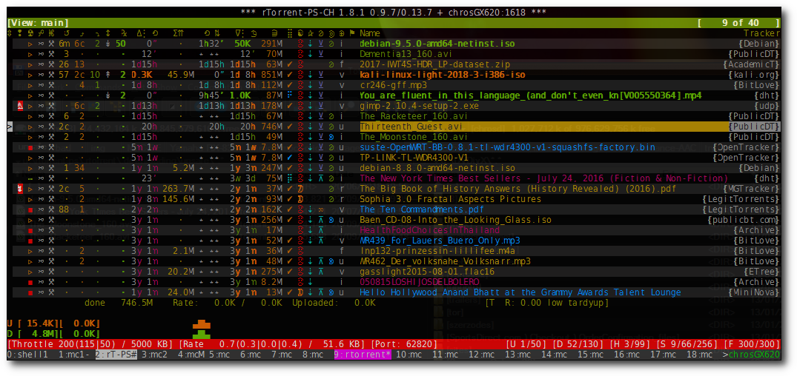

User's Manual
=============

.. contents:: **Contents**
    :depth: 1

Extended Canvas Explained
-------------------------

   *rTorrent-PS-CH collapsed canvas*

All the columns are configurable (can be disabled or new ones added on-the-fly) on the `extended canvas <https://rtorrent-ps.readthedocs.io/en/latest/customize.html#customizing-the-display-layout>`_ except for "Name" and "Tracker" columns, hence the previously included setup specific columns are removed from the built-in columns (they can be easily readded, see below how).

The following is an overview of the built-in column heading icons, their corresponding key definitions and what the values and icons in it mean.

.. |_| unicode:: 0xA0
   :trim:

.. table:: This is my table
    :widths: 5 35 60

==============  ==========================================  ===========
 Column          Key                                        Description
==============  ==========================================  ===========
 ❢              "100:1C95/1:❢"                              Message or alert indicator (♺ = Tracker cycle complete, i.e. “Tried all trackers”; ʘ = item’s data path does not exist (needs support by a cron job); ⇕ = establishing connection; ↯ = data transfer problem; ◔ = timeout; ¿ = unknown torrent / info hash; ⨂ = authorization problem (possibly temporary); ⋫ = tracker downtime; ☡ = DNS problems; ⚠ = other)
 ☢              "110:?1C92/1:☢"                              Item state (▹ = started, ╍ = paused, ▪ = stopped) (*sacrificial*)
 ☍              "120:?1:☍"                                  Tied item? [⚯] (*sacrificial*)
 ⌘              "130:?1:⌘"                                  Command lock-out? (⚒ = heed commands, ◌ = ignore commands) (*sacrificial*)
 ↺              "200:?2C23/2: |_| ↺"                        Number of completions from last scrape info \* (*sacrificial*)
 ⤴              "210:?2C15/2: |_| ⤵"                        Number of seeds from last scrape info \* (*sacrificial*)
 ⤵              "220:?2C14/2: |_| ⤵"                        Number of leeches from last scrape info \* (*sacrificial*)
 ↕              "300:?1:↕"                                  Transfer direction indicator [⇅ ↡ ↟] (*sacrificial*)
 ℞              "400:?2C28/2: |_| ℞"                         Number of connected peers * (*sacrificial*)
 ∆⋮ ⟲           "500:5C70/5: |_| ∆⋮ |_| ⟲"                  Approximate time since last active state (units are ``”’hdwmy`` from seconds to years) or upload rate
 Σ⇈             "600:?6C23/5C21/1: |_| |_| |_| Σ⇈ |_| |_|"        Uploaded data size (*sacrificial*)
 ∇⋮ ◷           "700:5C90/5: |_| ∇⋮ |_| ◷"                  Approximate time since completion (units are ``”’hdwmy`` from seconds to years); for incomplete items the download rate or, if there's no traffic, the time since the item was loaded
 ⛁              "800:4C15/3C21/1: |_| |_| ⛁ |_|"             Selected data size
 ⣿              "900:1C94/1:⣿"                              Completion status (✔ = done; else up to 8 dots [⣿] and ❚, i.e. progress in 10% steps); the old ``ui.style.progress.set`` command is deprecated, see `Defining Your Own Columns <https://rtorrent-ps.readthedocs.io/en/latest/customize.html#add-custom-columns>`_ for the new way to get a different set of glyphs or an ASCII version
 ☯              "920:1C93/1:☯"                              Ratio (☹  plus color indication for < 1, ➀  — ➉ : >= the number, ⊛ : >= 11);  the old ``ui.style.ratio.set`` command is deprecated, see `Defining Your Own Columns <https://rtorrent-ps.readthedocs.io/en/latest/customize.html#add-custom-columns>`_ for the new way to get a different set of glyphs or an ASCII version
 ✰              "940:1C91/1:✰"                              Priority (✖ = off, ⇣ = low, nothing for normal, ⇡ = high)
 ⊘              "950:1:⊘"                                   Throttle (none = global throttle, ∞ = NULL throttle, otherwise the first letter of the throttle name)
 ⚑              "980:1C16/1:⚑"                              A ⚑ indicates this item is on the ``tagged`` view
 Name                                                       Name of the download item – either the name contained in the metafile, or else the value of the displayname custom field when set on an item
Tracker                                                     Domain of the first HTTP tracker with seeds or leeches, or else the first one altogether – note that you can define nicer aliases using the `trackers.alias.set_key <https://rtorrent-docs.readthedocs.io/en/latest/cmd-ref.html#term-trackers-alias-set-key>`_ command in your configuration
==============  ==========================================  ===========

\* *The scrape info numbers are exact only for values below 100, else they
indicate the order of magnitude using roman numerals (c = 10², m = 10³,
X = 10⁴, C = 10⁵, M = 10⁶).*

A ``?`` sign at the beginning of a column definition indicates a ‘sacrificial’ column, which disappears when the display gets too narrow to display all the columns. When even that does not provide enough space, columns are omitted beginning on the right side (Name is always included). Sacrificial columns can also be toggled using the ``/`` key – note they’re toggled as a whole group, so other dynamic  column states are ignored.

The ``Cx`` values in a column definition are `dynamic color schemes <https://rtorrent-ps.readthedocs.io/en/latest/customize.html#column-layout-definitions>`_, the following extra schemes have been added:

- ``C70`` - ``ACTIVE_TIME``: for Uprate (∆ *seeding*) or approximate time since last active state (◷ *info* + *queued*) column
- ``C71`` - ``UNSAFE_DATA``: for Unsafe data (◎) column, depending on ``d.custom=unsafe_data``: *progress100*, *progress80*, *progress40*
- ``C72`` - ``THROTTLE_CH``: for Throttle column, depending on ``d.throttle_name``: none=*progress0*, ``slowup``=*progress20*, anything-else=*progress60*, ``NULL``=*progress100*
- ``C73`` - ``ETA_TIME``: for ETA (*info* + *leeching*) or last-xfer (*info* + *progress60*) column (⟲ ⇅)

Here's a configuration example showing all the built-in columns and their defaults:

.. code-block:: ini

    # Status flags (❢ ☢ ☍ ⌘)
    method.set_key = ui.column.render, "100:1C95/1:❢", ((array.at, {" ", "♺", "ʘ", "⚠", "◔", "⇕", "↯", "¿", "⨂", "⋫", "☡"}, ((d.message.alert)) ))
    method.set_key = ui.column.render, "110:?1C92/1:☢", ((string.map, ((cat, ((d.is_open)), ((d.is_active)))), {00, "▪"}, {01, "▪"}, {10, "╍"}, {11, "▹"}))
    method.set_key = ui.column.render, "120:?1:☍", ((array.at, {"⚯", " "}, ((not, ((d.tied_to_file)) )) ))
    method.set_key = ui.column.render, "130:?1:⌘", ((array.at, {"⚒", "◌"}, ((d.ignore_commands)) ))
    # Scrape info (↺ ⤴ ⤵)
    method.set_key = ui.column.render, "200:?2C23/2: ↺", ((convert.magnitude, ((d.tracker_scrape.downloaded)) ))
    method.set_key = ui.column.render, "210:?2C15/2: ⤴", ((convert.magnitude, ((d.tracker_scrape.complete)) ))
    method.set_key = ui.column.render, "220:?2C14/2: ⤵", ((convert.magnitude, ((d.tracker_scrape.incomplete)) ))
    # Traffic indicator (↕)
    method.set_key = ui.column.render, "300:?1:↕", ((string.map, ((cat, ((not, ((d.up.rate)) )), ((not, ((d.down.rate)) )) )), {00, "⇅"}, {01, "↟"}, {10, "↡"}, {11, " "} ))
    # Number of connected peers (℞)
    method.set_key = ui.column.render, "400:?2C28/2: ℞", ((convert.magnitude, ((d.peers_connected)) ))
    # Up|Last Active Time (∆⋮ ⟲)
    method.set_key = ui.column.render, "500:5C70/5: ∆⋮ ⟲", ((if, ((d.up.rate)), ((convert.human_size, ((d.up.rate)), ((value, 10)) )), ((if, ((d.peers_connected)), ((cat, "   0”")), ((convert.time_delta, ((value, ((d.custom, last_active)) )) )) )) ))
    # Upload total (Σ⇈)
    method.set_key = ui.column.render, "600:?6C23/5C21/1:  Σ⇈  ", ((if, ((d.up.total)), ((convert.human_size, ((d.up.total)), (value, 0))), ((cat, "   ⋅  ")) ))
    # Down|Completion or Loaded Time (∇⋮ ◷)
    method.set_key = ui.column.render, "700:5C90/5: ∇⋮ ◷", ((if, ((d.down.rate)), ((convert.human_size, ((d.down.rate)), ((value, 10)) )), ((convert.time_delta, ((value, ((d.custom.if_z, tm_completed, ((d.custom, tm_loaded)) )) )) )) ))
    # Data size (⛁)
    method.set_key = ui.column.render, "800:4C15/3C21/1:  ⛁ ", ((convert.human_size, ((d.selected_size_bytes)) ))
    # Progress (⣿)
    method.set_key = ui.column.render, "900:1C94/1:⣿", ((string.substr, " ⠁⠉⠋⠛⠟⠿⡿⣿❚", ((math.div, ((math.mul, ((d.completed_chunks)), 10)), ((math.add, ((d.completed_chunks)), ((d.wanted_chunks)))) )), 1, "✔"))
    # Ratio (☯)
    method.set_key = ui.column.render, "920:1C93/1:☯", ((string.substr, "☹➀➁➂➃➄➅➆➇➈➉", ((math.div, ((d.ratio)), 1000)), 1, "⊛"))
    # Explicitly managed status (✰ = prio; ⊘ = throttle name; ⚑ = tagged)
    method.set_key = ui.column.render, "940:1C91/1:✰", ((array.at, {"✖", "⇣", " ", "⇡"}, ((d.priority)) ))
    method.set_key = ui.column.render, "950:1:⊘", {(branch, ((equal,((d.throttle_name)),((cat,NULL)))), ((cat, "∞")), ((d.throttle_name)) )}
    method.set_key = ui.column.render, "980:1C16/1:⚑", ((array.at, {" ", "⚑"}, ((d.views.has, tagged)) ))

To add back the two removed "Unsafe data" and "Data directory" columns, add these lines into your config or run these in ``rTorrent-PS-CH`` on-the-fly at command prompt (``^x``):

.. code-block:: ini

    # Add "Unsafe data" column (◎) after "Throttle" column (⊘)
    method.set_key = ui.column.render, "960:1C71/1:◎", ((string.map, ((cat, ((d.custom, unsafe_data)))), {0, " "}, {1, "⊘"}, {2, "⊗"}))
    # Add "Data directory" column (⊕) (first character of parent directory) after "Unsafe data" column (◎)
    method.set_key = ui.column.render, "970:1:⊕", ((d.parent_dir))

==============  ==========================================  ===========
 Column          Key                                        Description
==============  ==========================================  ===========
 ◎              "960:1C71/1:◎"                              Unsafe-data (none = safe data, ⊘ = unsafe data, ⊗ = unsafe data with delqueue)
 ⊕              "970:1:⊕"                                   Data directory (none = base path entry is missing, otherwise the first letter of the name of data directory)
==============  ==========================================  ===========

The following is a short example how to disable/override built-in columns, more examples can be found at the `Extra column definitions <https://github.com/chros73/rtorrent-ps-ch_setup/blob/master/ubuntu-14.04/home/chros73/.pyroscope/rtorrent-ps.rc#L198>`_ section of ``rtorrent-ps.rc`` of ``rtorrent-ps-ch_setup``.

.. code-block:: ini

    # Disable Number of connected peers (℞) column
    method.set_key = ui.column.render, (ui.column.spec, 400)
    # Override built-in "Throttle" column (⊘) with a new one
    method.set_key = ui.column.render, (ui.column.spec, 950)
    method.set_key = ui.column.render, "951:1C72/1:⊘", ((string.map, ((d.throttle_name)), {"", " "}, {NULL, "∞"}, {slowup, "⊼"}, {tardyup, "⊻"}))

Adding Traffic Graphs
^^^^^^^^^^^^^^^^^^^^^

Take a look at the `Adding Traffic Graphs <https://rtorrent-ps.readthedocs.io/en/latest/customize.html#adding-traffic-graphs>`_ section of rTorrent Handbook.

Setting Up Your Terminal
^^^^^^^^^^^^^^^^^^^^^^^^

Whatever font you use in your terminal profile, it of course has to support the
characters used in the status columns. Also, your terminal **must** be
set to use UTF-8 (which nowadays usually is the default anyway), that
means ``LANG`` should be something like ``en_US.UTF-8``, and ``LC_ALL``
and ``LC_CTYPE`` should **not** bet set at all! If you use a terminal
multiplexer like most people do, and the display doesn't look right, try
``tmux -u`` respectively ``screen -U`` to force UTF-8 mode. Also make
sure you have the ``locales`` package installed on Debian-type systems.

Connecting via SSH from Windows using PuTTY/KiTTY (version >=0.70), take a look at this small `guide <https://github.com/chros73/rtorrent-ps-ch_setup/wiki/Windows-8.1#connect-via-ssh>`_.

The following command lets you easily check whether your font supports
all the necessary characters and your terminal is configured correctly:

.. code-block:: shell

    python -c 'print u"\u22c5 \u201d \u2019 \u266f \u2622 \u260d \u2318 \u2730 " \
        u"\u22ee \u262f \u2691 \u21ba \u2934 \u2935 \u2206 \u2207 \u26a0 \u25d4 " \
        u"\u21af \u00bf \u2a02 \u2716 \u21e3 \u21e1 \u25b9 \u254d \u25aa \u26af " \
        u"\u2692 \u25cc \u21c5 \u21a1 \u219f \u229b \u267a \u22c6 \u2026 \u21f3 " \
        u"\u2308 \u2309 \u230a \u230b \u2298 \u221e \u21a8 \u2762 \u0298 \u21d5 " \
        u"\u22eb \u2621 \u2195 \u211e \u27f2 \u25f7 \u03a3 \u21c8 \u2714 \u26c1 " \
        u"\u2639 \u2780 \u2781 \u2782 \u2783 \u2784 \u2785 \u2786 \u2787 \u2788 \u2789 " \
        u"\u2801 \u2809 \u280b \u281b \u281f \u283f \u287f \u28ff \u275a " \
        u"\u2581 \u2582 \u2583 \u2584 \u2585 \u2586 \u2587 \u2588 ".encode("utf8")'

``⋅ ” ’ ♯ ☢ ☍ ⌘ ✰ ⋮ ☯ ⚑ ↺ ⤴ ⤵ ∆ ∇ ⚠ ◔ ↯ ¿ ⨂ ✖ ⇣ ⇡ ▹ ╍ ▪ ⚯ ⚒ ◌ ⇅ ↡ ↟ ⊛ ♺ ⋆ … ⇳ ⌈ ⌉ ⌊ ⌋ ⊘ ∞ ↨ ❢ ʘ ⇕ ⋫ ☡ ↕ ℞ ⟲ ◷ Σ ⇈ ✔ ⛁ ☹ ➀ ➁ ➂ ➃ ➄ ➅ ➆ ➇ ➈ ➉ ⠁ ⠉ ⠋ ⠛ ⠟ ⠿ ⡿ ⣿ ❚ ▁ ▂ ▃ ▄ ▅ ▆ ▇
█``

Supporting 256 or more colors
^^^^^^^^^^^^^^^^^^^^^^^^^^^^^

Having 256 colors you can use color gradients for ratio coloring,
and much more appropriate pallid color shades for backgrounds.

To enable 256 colors, your terminal must obviously be able to support
them at all (i.e. have a ``xterm-256color`` terminfo entry, or similar).
But even if that is the case, you often need to give a little nudge to
the terminal multiplexers; namely start ``tmux`` with the ``-2`` switch
(that forces 256 color mode), or for ``screen`` start it with the
terminal already set to 256 color mode so it can sense the underlying
terminal supports them. Take a look at the small `tmux guide <DebianInstallFromSourceTheEasyWay.rst#note-about-tmux>`_.

You can create your own color theme by using the `ui.color.*= <https://rtorrent-docs.readthedocs.io/en/latest/cmd-ref.html#term-ui-color-alarm>`_ commands or find several color themes in the `contrib <contrib/>`_ folder.

Extra Keyboard Shortcuts
------------------------

There are extra keyboard shortcuts defined along with the `original ones in rTorrent <https://github.com/rakshasa/rtorrent/wiki/User-Guide#navigating>`_ (see all the `extra built-in ones <https://github.com/chros73/rtorrent-ps-ch_setup/wiki/Additions#extra-keyboard-shortcuts-in-rtorrent>`_).

==============  ====================================
 Column         Description
==============  ====================================
 F              subfilter the current view based on the name of downloads by entering a regexp (capital ``f``)
 ↑, ↓           prev, next in input history (at any input prompt, e.g. at ``^x``)
 ESC            exit from any input prompt (e.g. at ``^x``)
==============  ====================================

.. _commands:

Extra commands
--------------

The following new commands are available along with the well documented ones in `rTorrent Handbook <https://rtorrent-docs.readthedocs.io/en/latest/cmd-ref.html>`_.

.. contents:: List of Commands
   :local:

event.download.partially_restarted
^^^^^^^^^^

Event (multi commands) that will be triggered when a download is being partially restarted: when previously deselected files are selected of a finished download. Example usage:

.. code-block:: ini

    method.set_key = event.download.partially_restarted, ~log, ((print, "Partially restarted : ", ((d.name))))

method.insert.[bool|string|list]
^^^^^^^^^^

Similarly to ``method.insert.value`` method, they create public, mutable properties. Example usage:

.. code-block:: ini

    method.insert.list = foo, {"z1", "z2", "z3"}

d.custom[.set]=last_active|tm_completed[,«timestamp»]
^^^^^^^^^^

Custom fileds ``d.custom=last_active`` and ``d.custom=tm_completed`` hold timestamps: the last time when items had peers and time of completion. They are also displayed on the collapsed display.

d.allocatable_size_bytes=
^^^^^^^^^^

Returns the size needed to create the selected files of a download in Bytes.

d.eta.{seconds|time}=
^^^^^^^^^^^^^^^^^^^^^

While ``d.eta.time`` gives the estimated time left in short human readable format (e.g.: ``1h34’``), ``d.eta.seconds`` gives it in seconds: ``0`` = download is partially done, ``-1`` = download speed is less than `512` Byte/s.

d.parent_dir=
^^^^^^^^^^^^^

Returns the name of the parent directory of a download.

d.selected_size_bytes=
^^^^^^^^^^

Returns the size of the selected files of a download in Bytes. It returns the ``completed_bytes`` if a download is only partyally done (and not the slected size of files, since they can be turnd off later!), or calculates the partial size based on the selected chunks of the selected files if a downalod hasn't been (partially) finished.

d.is_enough_diskspace=
^^^^^^^^^^

Returns boolean, determines whether there's enough space for the selected files of a download on the selected partition of an HDD.

d.is_done=
^^^^^^^^^^

Returns boolean, determines whether all the files of a download have been finished (to be able to distinguish between finished and partially done downloads).

f.is_fallocatable=
^^^^^^^^^^

Returns boolean, determines whether a file has ``flag_fallocate`` flag.

f.is_fallocatable_file=
^^^^^^^^^^

Returns boolean, determines whether a file has both ``flag_fallocate`` and ``flag_resize_queued`` flag.

f.[un]set_fallocate=
^^^^^^^^^^

``f.set_fallocate`` and ``f.unset_fallocate`` commands are setter methods for ``flag_fallocate`` flag of a file.

array.size=«cmd»
^^^^^^^^^^

Returns size of an array.

convert.group=«cmd»
^^^^^^^^^^

Returns a formatted (2 characters padded) string for a number, e.g.: ``--``, `` 2``, ``125``. It's used to display max choke group values on Info screen.

directory.watch.added=«dir»,«cmd»[,«cmd1»,«cmd2»,…]
^^^^^^^^^^^^^^^^^^^^^^^

`directory.watch.added <https://github.com/chros73/rtorrent-ps-ch/issues/87>`_ adds ``inotify`` support for added meta files.

First parameter is the directory that will be watched, second is the name of the main command that will be called if an "add" event is triggered (``load.*`` commands), while the rest of the parameters are  a comma separated list of extra commands that will be passed as arguments to the main command specified as the second parameter. Note that if an extra command includes commas (``,`` parameter separator) then it needs to be included inside quotes (``"``). Limitation: a given directory can only be specified once with either  ``directory.watch.added`` or ``directory.watch.removed``.

.. code-block:: ini

    directory.watch.added = (cat,(cfg.dir.meta_downl),unsafe/),   load.start,  "d.attribs.set=unsafe,,1", print=loadedunsafe

directory.watch.removed=«cmd»,«dir1»[,«dir2»,…]
^^^^^^^^^^^^^^^^^^^^^^^

`directory.watch.removed <https://github.com/chros73/rtorrent-ps-ch/issues/87>`_ adds ``inotify`` support for removed meta files.

It only supports 3 commands as the first parameter: ``d.stop``, ``d.close``, ``d.erase``; rest of the parameters are a comma separated list of the directories that will be watched. Limitation: a given directory can only be specified once with either  ``directory.watch.added`` or ``directory.watch.removed``.

.. code-block:: ini

    directory.watch.removed = d.erase, (cat,(cfg.dir.meta_compl),various/), (cat,(cfg.dir.meta_compl),unsafe/)

match=«cmd1»,«cmd2»
^^^^^^^^^^^^^^^^^^^^^^^^^^^^^^^^^

Regexp based comparison operator can work with strings or values (integers), returned from the given commands, its return value is boolean. 

.. code-block:: ini

    method.insert = match_name, simple, "match={d.name=,.*linux.*iso}"

try=«cmd»
^^^^^^^^^^

Catches input_errors of ``cmd`` and logs them on rpc_events. 

view.temp_filter=«viewname»[,«cmd»]
^^^^^^^^^^^^^^^^^^^^^^^^^^^^^^^^^

Apply temp filter to a view. If ``«cmd»`` isn't supplied it removes the previously applied temp filter.

.. code-block:: ini

    view.temp_filter=main, "match={d.name=,.*linux.*iso}"

view.temp_filter.excluded[.set]="[«viewname1»,«viewname2»,…]"
^^^^^^^^^^^^^^^^^^^^^^^^^^^^^^^^^

Get / set a list of views that can be excluded from subfiltering. Its default value is:

.. code-block:: ini

    view.temp_filter.excluded.set="default,started,stopped"

view.temp_filter.log[.set]=0|1
^^^^^^^^^^^^^^^^^^^^^^^^^^^^^^^^^

Determines whether subfiltering is logged onto the messages view (key `l`). Disabled by default, to enable it:

.. code-block:: ini

    view.temp_filter.log.set=1

ui.input.history.size[.set]=«value»
^^^^^^^^^^^^^^^^^^^^^^^^^^^^^^^^^^^

Get / set the size of `input history <https://github.com/chros73/rtorrent-ps-ch/issues/83>`_. Default value is:

.. code-block:: ini

    ui.input.history.size.set=99

ui.input.history.clear=
^^^^^^^^^^^^^^^^^^^^^^^

Clear all the `input history <https://github.com/chros73/rtorrent-ps-ch/issues/83>`_.

ui.status.throttle.{up|down}[.set]=«throttlename»[,«throttlename»]
^^^^^^^^^^^^^^^^^^^^^^^^^^^^^^^^^^^^^^^^^^^^^^^^^^^^^^^^^^^^^^^^

Displays values of the given ``throttle.up``/``throttle.down`` in the first part of status bar, multiple comma separated names can be given.
Include the max limit of the throttle, the main upload/download rate and the upload/download rate of the throttle (in this order).

Original: ``[Throttle 500/1500 KB] [Rate: 441.6/981.3 KB]``

Modified possible cases:

.. code-block::

    [Throttle 200 / 500 KB] [Rate 107.4 / 298.6 KB]
    [Throttle 200(114) / 500 KB] [Rate 107.0(1.0|105.9) / 307.6 KB]
    [Throttle 200 / 500(250) KB] [Rate 124.7 / 298.2(298.2|0.0) KB]
    [Throttle 200(114) / 500(250) KB] [Rate 115.9(1.7|114.2) / 333.9(333.9|0.0) KB]
    [Throttle 500(154|25) / 1500 KB] [Rate 399.6(365.9|8.3|25.4) / 981.3 KB]

Limitation is that every group (there are 4 possible groups) can contain the following number of characters (it leaves space for at least 5 throttles to be displayed): 40 chars for limits, 50 chars for rates.

This extra info isn't displayed in the following cases:

   - there isn't any ``throttle.up``/``throttle.down`` name as the config variable suggest or the given name is "NULL"
   - ``throttle.up``/``throttle.down`` is not throttled (=0)
   - the global upload/download is not throttled (=0) (``throttle.up``/``throttle.down`` won't be taken into account in this case)

Configuration example:

.. code-block:: ini

    ui.status.throttle.up.set=slowup,tardyup
    ui.status.throttle.down.set=slowdown

ui.throttle.global.step.{small|medium|large}[.set]=«value»
^^^^^^^^^^^^^^^^^^^^^^^^^^^^^^^^^^^^^^^^^^^^^^^^^^^^^^^^^^

Set `global throttle steps <https://github.com/rakshasa/rtorrent/wiki/User-Guide#throttling>`_. Their default value is:

.. code-block:: ini

    ui.throttle.global.step.small.set  =   5
    ui.throttle.global.step.medium.set =  50
    ui.throttle.global.step.large.set  = 500

